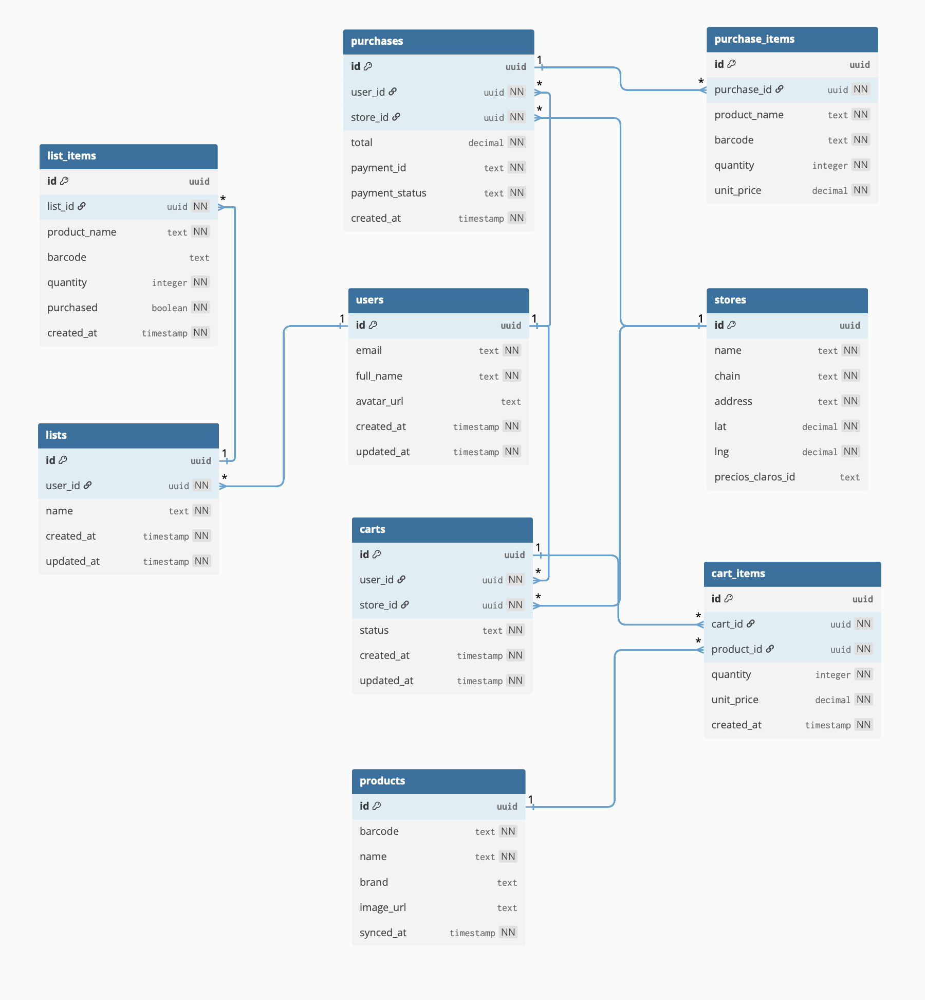

# Diagrama Entidad-Relación — ChanguiApp



---

## Entidades

| Entidad | Descripción |
|---|---|
| `users` | Extiende el perfil de Supabase Auth con datos adicionales del usuario |
| `stores` | Supermercados disponibles, sincronizados desde la API de Precios Claros |
| `products` | Catálogo de productos sincronizado masivamente desde Precios Claros |
| `carts` | Carrito activo del usuario en un supermercado |
| `cart_items` | Productos dentro de un carrito con cantidad y precio al momento del escaneo |
| `lists` | Listas de compras creadas por el usuario |
| `list_items` | Items de una lista; se marcan como `purchased = true` al escanearlos |
| `purchases` | Historial de compras completadas y confirmadas por Mercado Pago |
| `purchase_items` | Snapshot de los productos comprados al momento del pago |

---

## Relaciones
```
users        1 ──── N   carts
users        1 ──── N   lists
users        1 ──── N   purchases
stores       1 ──── N   carts
stores       1 ──── N   purchases
carts        1 ──── N   cart_items
products     1 ──── N   cart_items
lists        1 ──── N   list_items
purchases    1 ──── N   purchase_items
```

---

## Decisiones de diseño

- **`users` no replica datos de Supabase Auth** — solo extiende el perfil. La autenticación la gestiona Auth internamente.
- **Un solo carrito `active` por usuario** — restricción validada a nivel de backend.
- **`unit_price` se guarda en `cart_items` y `purchase_items`** — el precio queda fijo al momento del evento, independiente de cambios futuros en el catálogo.
- **`list_items` no tiene FK a `products`** — el usuario puede agregar items manualmente sin barcode. El vínculo se resuelve al escanear en el supermercado.
- **`purchase_items` guarda `product_name` y `barcode` como texto** — snapshot inmutable del estado del producto al momento de la compra.