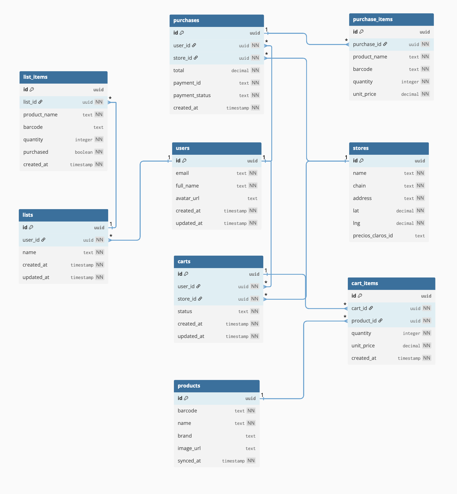

# Diagrama Entidad-Relación — ChanguiApp



> Nota: la imagen se regenera al exportar el esquema. La entidad `tax_categories`
> y las columnas fiscales (DEV-165) ya están reflejadas en las tablas de abajo y
> en `db/schema.sql`; la imagen se actualiza por separado.

---

## Entidades

| Entidad          | Descripción                                                                                                                                                           |
| ---------------- | --------------------------------------------------------------------------------------------------------------------------------------------------------------------- |
| `users`          | Extiende el perfil de Supabase Auth con datos adicionales del usuario                                                                                                 |
| `stores`         | Supermercados disponibles, sincronizados desde la API de Precios Claros                                                                                               |
| `products`       | Catálogo de productos con precio, sincronizado masivamente desde Precios Claros. Tiene `tax_category_id` (categoría fiscal asignada) y `tax_locked` (override manual) |
| `tax_categories` | Catálogo de categorías fiscales con su alícuota de IVA (Ley 23.349), keywords de clasificación y referencia legal                                                     |
| `carts`          | Carrito activo del usuario en un supermercado                                                                                                                         |
| `cart_items`     | Productos dentro de un carrito con cantidad y precio al momento del escaneo                                                                                           |
| `lists`          | Listas de compras creadas por el usuario                                                                                                                              |
| `list_items`     | Items de una lista; se marcan como `purchased = true` al escanearlos                                                                                                  |
| `purchases`      | Historial de compras completadas y confirmadas por Mercado Pago                                                                                                       |
| `purchase_items` | Snapshot de los productos comprados al momento del pago                                                                                                               |

---

## Relaciones

```
users        1 ──── N   carts
users        1 ──── N   lists
users        1 ──── N   purchases
stores       1 ──── N   carts
stores       1 ──── N   purchases
carts        1 ──── N   cart_items
products     1 ──── N   cart_items
lists        1 ──── N   list_items
purchases    1 ──── N   purchase_items
tax_categories 1 ──── N products
```

---

## Alcance del MVP

> **ChanguiApp v1 es un MVP que opera con un único supermercado.**
> El diagrama, sin embargo, está diseñado con visión de futuro: la entidad `stores` existe desde el inicio para que la arquitectura soporte, sin cambios de esquema, la incorporación de múltiples cadenas en versiones posteriores.

En el MVP:

- Hay un único `store` activo en la base de datos.
- El usuario no selecciona supermercado; el carrito y las compras se asocian automáticamente a ese store.
- La FK `store_id` en `carts` y `purchases` ya está presente para que la expansión multi-supermercado sea transparente a futuro.

---

## Decisiones de diseño

- **`users` no replica datos de Supabase Auth** — solo extiende el perfil. La autenticación la gestiona Auth internamente.
- **Un solo carrito `active` por usuario** — restricción validada a nivel de backend.
- **`unit_price` se guarda en `cart_items` y `purchase_items`** — el precio queda fijo al momento del evento, independiente de cambios futuros en el catálogo.
- **`list_items` no tiene FK a `products`** — el usuario puede agregar items manualmente sin barcode. El vínculo se resuelve al escanear en el supermercado.
- **`purchase_items` guarda `product_name` y `barcode` como texto** — snapshot inmutable del estado del producto al momento de la compra.
- **`products.price` refleja el precio actual sincronizado** — se actualiza diariamente vía cron desde Precios Claros. `cart_items.unit_price` congela el precio al momento del escaneo.
- **El IVA se modela con `tax_categories`, no con un campo de tasa en `products`** — la alícuota vive en la categoría (normalizado): si cambia la ley se edita una fila. `products.tax_category_id` apunta a la categoría asignada por el clasificador; `tax_locked` marca un override manual que el sync respeta.
- **`purchase_items.tax_rate` congela la alícuota al momento de la compra** — un comprobante emitido es inmutable: el desglose del ticket no cambia aunque luego se recategorice el producto. El desglose en producto y carrito, en cambio, se calcula en runtime con la categoría vigente.
- **El precio de Precios Claros ya incluye IVA (Ley 27.221)** — la base imponible y el IVA se despejan hacia atrás; no se almacenan, se calculan al vuelo.
