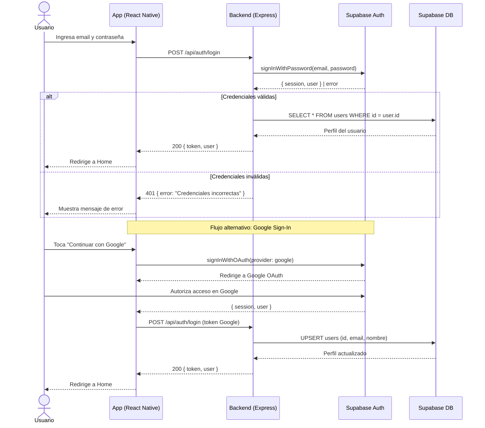

# Diagrama de Secuencia — Autenticación / Login

Cubre los dos flujos de autenticación de ChanguiApp: email/contraseña y Google Sign-In, ambos a través de Supabase Auth.

## Actores y sistemas

| Participante | Descripción |
|---|---|
| Usuario | Persona que usa la app |
| App (React Native) | Cliente móvil (Android / iOS) |
| Backend (Express) | Servidor Node.js desplegado en Render |
| Supabase Auth | Servicio de autenticación de Supabase |
| Supabase DB | Base de datos PostgreSQL en Supabase |

## Endpoints involucrados

- `POST /api/auth/login`
