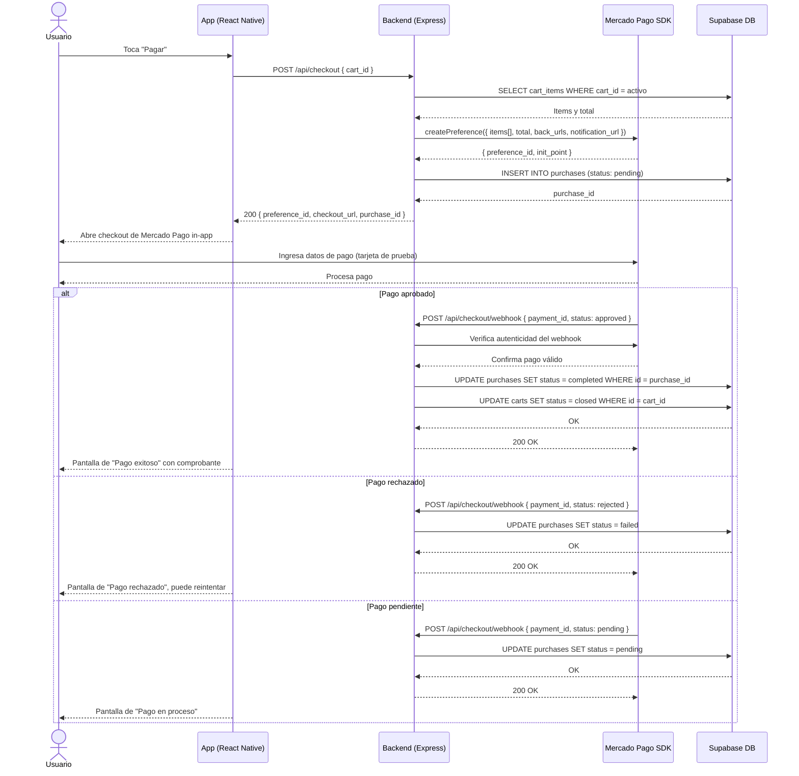

# Diagrama de Secuencia — Checkout y Pago

Cubre el flujo de pago in-app mediante Mercado Pago (modo sandbox), incluyendo los tres estados posibles del webhook: aprobado, rechazado y pendiente.

## Actores y sistemas

| Participante | Descripción |
|---|---|
| Usuario | Persona que usa la app |
| App (React Native) | Cliente móvil (Android / iOS) |
| Backend (Express) | Servidor Node.js desplegado en Render |
| Mercado Pago SDK | Pasarela de pagos (modo sandbox/test) |
| Supabase DB | Base de datos PostgreSQL en Supabase |

## Endpoints involucrados

- `POST /api/checkout`
- `POST /api/checkout/webhook`
