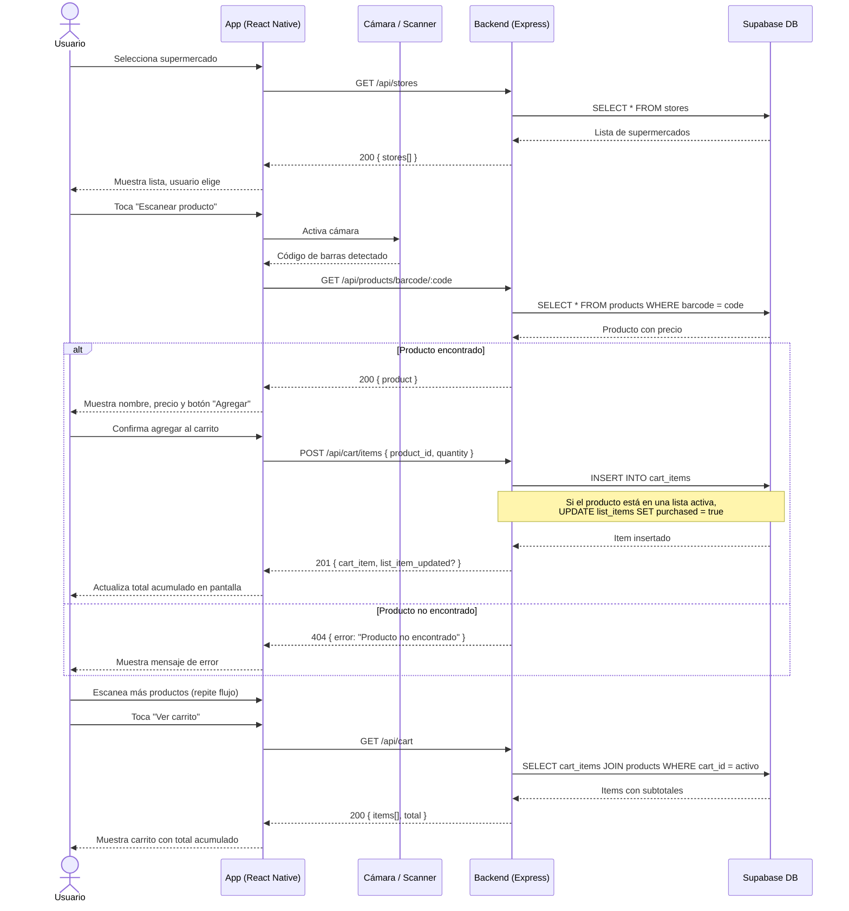

# Diagrama de Secuencia — Scan & Go

Cubre el flujo completo de escaneo de productos y gestión del carrito, incluyendo el tachado automático de items de listas de compras activas.

## Actores y sistemas

| Participante | Descripción |
|---|---|
| Usuario | Persona que usa la app dentro del supermercado |
| App (React Native) | Cliente móvil (Android / iOS) |
| Cámara / Scanner | Sensor de cámara del dispositivo para lectura de barcode |
| Backend (Express) | Servidor Node.js desplegado en Render |
| Supabase DB | Base de datos PostgreSQL en Supabase (catálogo sincronizado desde Precios Claros) |

## Endpoints involucrados

- `GET /api/stores`
- `GET /api/products/barcode/:code`
- `POST /api/cart/items`
- `GET /api/cart`
