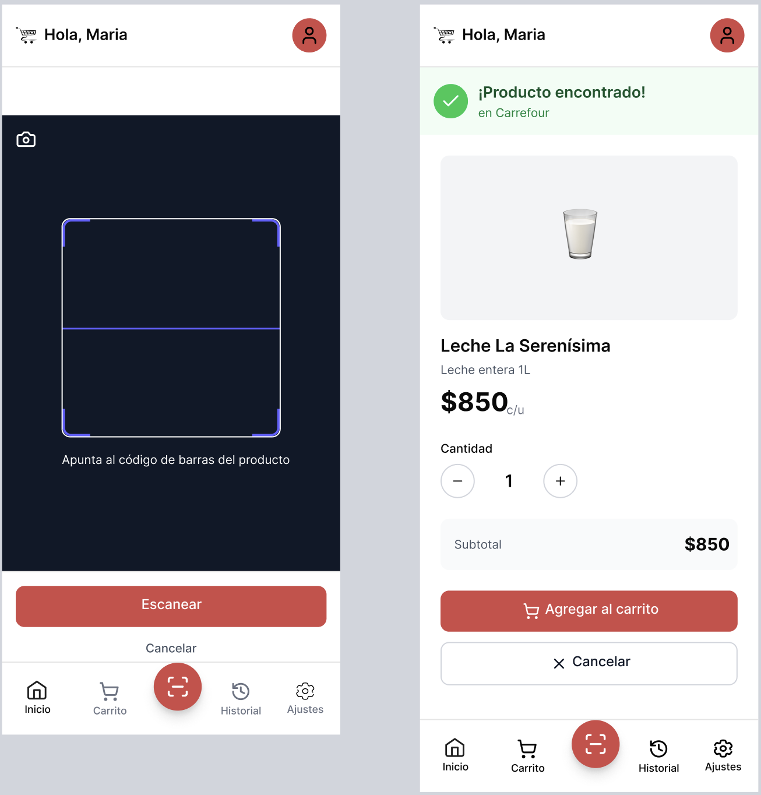
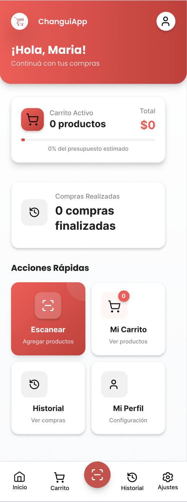
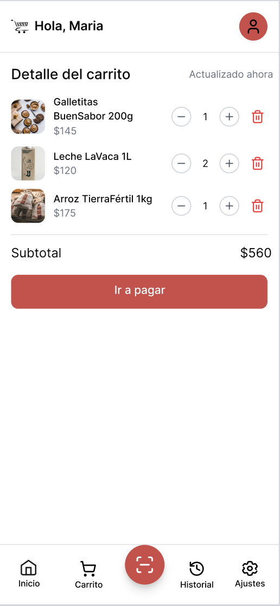
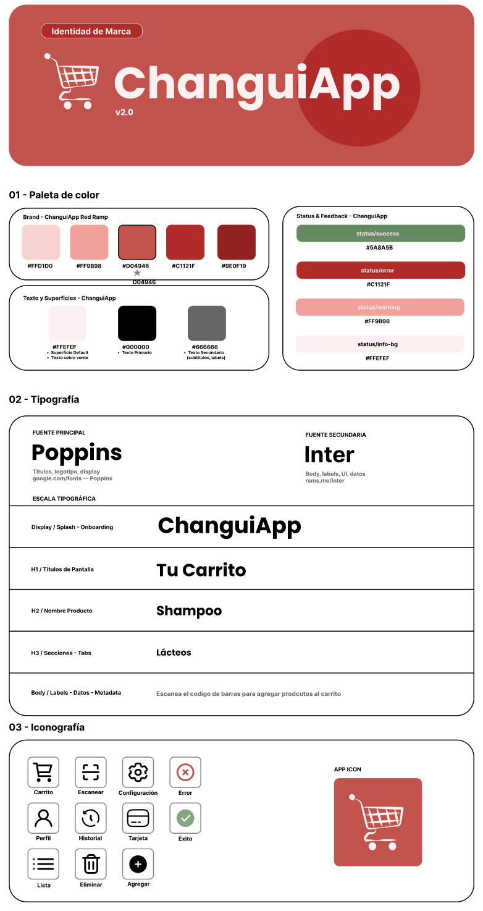
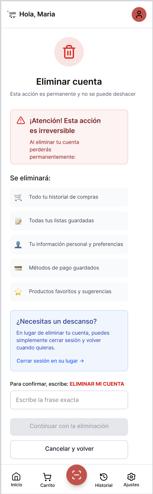
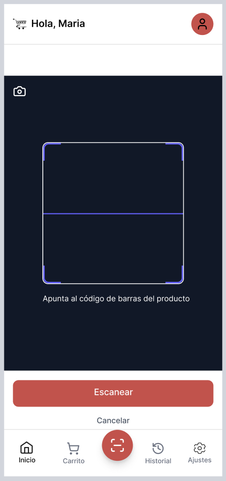
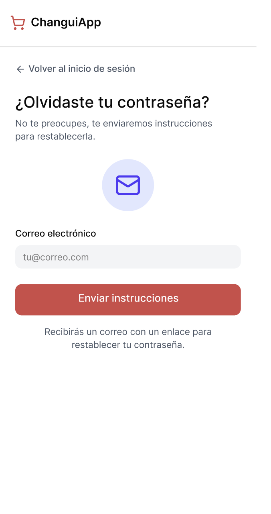
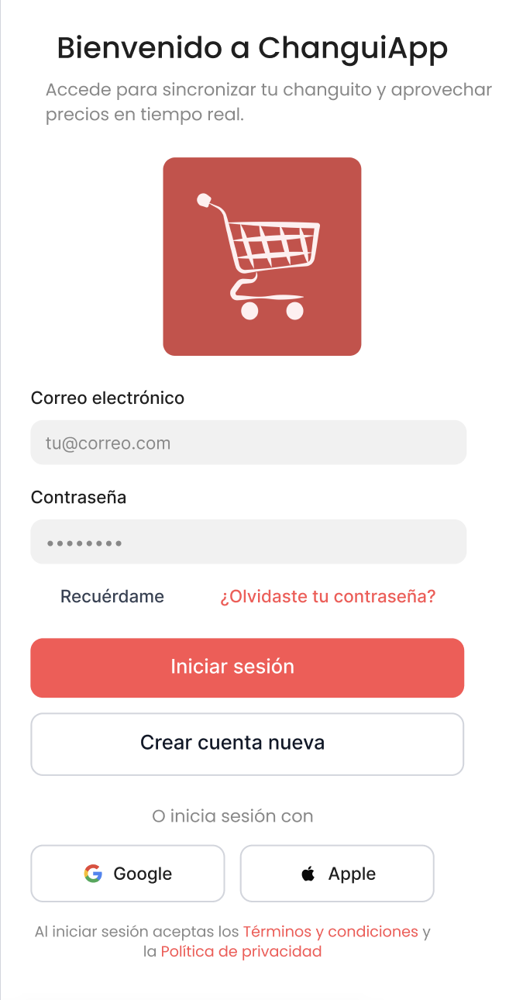

# Heurísticas de Nielsen y Buenas Prácticas de Accesibilidad — ChanguiApp

> Documento de evidencia para la Entrega 1.
> Mapea cada una de las 10 heurísticas de Nielsen a pantallas concretas del prototipo Figma,
> e incluye un checklist de accesibilidad con los criterios aplicados en el diseño.

---

## 1. Visibilidad del estado del sistema

> El sistema siempre debe mantener al usuario informado sobre lo que está ocurriendo, con feedback apropiado en un tiempo razonable.

**Cómo se aplica en ChanguiApp:**

- El **total acumulado del carrito** se actualiza en tiempo real a medida que el usuario escanea productos, visible de forma permanente en la pantalla de escaneo.
- Al agregar un producto al carrito, se muestra una confirmación visual inmediata (toast / snackbar) con el nombre y precio del producto.
- Durante el procesamiento del pago, se muestra una pantalla de carga con estado "Procesando pago…" para que el usuario sepa que la operación está en curso.
- Los ítems de una lista de compras muestran un tilde/tachado inmediato al ser escaneados y agregados al carrito.

**Pantalla de evidencia en Figma:**  

  

---

## 2. Correspondencia entre el sistema y el mundo real

> El sistema debe hablar el idioma del usuario, usando palabras, frases y conceptos familiares, siguiendo convenciones del mundo real.

**Cómo se aplica en ChanguiApp:**

- Se usa vocabulario cotidiano argentino: "carrito", "lista de compras", "escanear", "pagar", "supermercado".
- Los íconos utilizados son reconocibles sin necesidad de etiqueta: carrito de compras, código de barras, lista con tilde, billetera.
- El flujo de la app replica el proceso físico de ir al supermercado: elegir dónde comprás → escanear productos → revisar carrito → pagar.
- Los precios se muestran en formato argentino (`$1.250,00`) con el símbolo de peso.

**Pantalla de evidencia en Figma:**  

  

---

## 3. Control y libertad del usuario

> Los usuarios suelen elegir funciones del sistema por error y necesitan una salida de emergencia clara para dejar el estado no deseado.

**Cómo se aplica en ChanguiApp:**

- El usuario puede **eliminar ítems individuales** del carrito con un gesto de swipe o botón de eliminar, sin necesidad de vaciar todo el carrito.
- Existe la opción de **cancelar el carrito completo** con un paso de confirmación ("¿Seguro que querés cancelar la compra?") para evitar cancelaciones accidentales.
- Al agregar un ítem a una lista de compras, el usuario puede deshacer la acción antes de que el toast desaparezca.
- En el flujo de pago, el usuario puede volver al carrito antes de confirmar el checkout.

**Pantalla de evidencia en Figma:**  

  

---

## 4. Consistencia y estándares

> Los usuarios no deberían tener que preguntarse si diferentes palabras, situaciones o acciones significan lo mismo.

**Cómo se aplica en ChanguiApp:**

- Se aplica **Material Design 3** de forma consistente en toda la app: botones, tipografía, colores, espaciados y componentes siguen el mismo sistema de diseño.
- Los colores del brand se usan de forma consistente: `#D04946` para acciones primarias y elementos de marca, `#FFEFEF` para superficies y fondos, `#5A8A5B` exclusivamente para estados de éxito/confirmación y `#C1121F` para errores.
- La navegación inferior es consistente en todas las pantallas principales (Home, Escanear, Listas, Perfil).
- Los mensajes de error siguen siempre el mismo formato: ícono de alerta + texto descriptivo + acción sugerida.
- La tipografía es consistente: **Poppins** para títulos y displays, **Inter** para body, labels y datos.

**Pantalla de evidencia en Figma:**  

  

---

## 5. Prevención de errores

> Mejor que un buen mensaje de error es un diseño cuidadoso que evite que el problema ocurra.

**Cómo se aplica en ChanguiApp:**

- El botón **"Pagar"** está deshabilitado si el carrito está vacío, evitando iniciar un checkout sin ítems.
- Antes de **cancelar el carrito** o **eliminar una lista**, se muestra un modal de confirmación para evitar pérdidas accidentales de datos.
- Al **modificar la cantidad** de un ítem en el carrito, el campo numérico no permite valores menores a 1 ni valores no numéricos.
- Si el usuario intenta escanear sin conexión a internet, se muestra un aviso preventivo antes de activar la cámara.

**Pantalla de evidencia en Figma:**  

  

---

## 6. Reconocimiento en lugar de recuerdo

> Minimizar la carga de memoria del usuario haciendo visibles los objetos, acciones y opciones relevantes.

**Cómo se aplica en ChanguiApp:**

- El **carrito siempre muestra la lista de ítems** escaneados con nombre, cantidad y precio unitario, sin que el usuario tenga que recordar qué agregó.
- En la pantalla de escaneo se muestra el **nombre del supermercado seleccionado** de forma permanente para que el usuario no tenga que recordar cuál eligió.
- Las **listas de compras** muestran el porcentaje de ítems ya comprados para que el usuario vea de un vistazo cuánto le falta.
- El historial de compras muestra el nombre del supermercado, la fecha y el total de cada compra pasada.

**Pantalla de evidencia en Figma:**   

  

---

## 7. Flexibilidad y eficiencia de uso

> Los aceleradores, invisibles para el usuario novato, permiten al usuario experto realizar acciones más rápido.

**Cómo se aplica en ChanguiApp:**

- Los usuarios frecuentes pueden acceder directamente a sus **listas de compras guardadas** desde la pantalla de inicio, sin pasar por la selección de supermercado.
- El escaneo es el flujo principal y **no requiere más de un tap** para activar la cámara desde la pantalla principal.
- El usuario puede **ajustar la cantidad** de un ítem directamente desde el carrito sin tener que eliminarlo y volver a escanear.
- Los tamaños de fuente son configurables desde la app para adaptarse a las preferencias del usuario.

**Pantalla de evidencia en Figma:**  

  

---

## 8. Diseño estético y minimalista

> Los diálogos no deben contener información irrelevante o raramente necesaria. Cada unidad extra de información compite con la información relevante.

**Cómo se aplica en ChanguiApp:**

- La interfaz usa **tema claro con alto contraste** sobre fondo `#FFEFEF` y `#FFFFFF`, optimizado para ambientes con iluminación intensa (supermercados), evitando el ruido visual.
- La pantalla de escaneo muestra únicamente la cámara, el total acumulado y un botón para ver el carrito — sin distracciones.
- La navegación inferior tiene **4 ítems como máximo**, siguiendo las recomendaciones de Material Design para no sobrecargar la barra de navegación.
- No se usan animaciones decorativas que puedan ralentizar la percepción de la app en el contexto de uso.
- El uso del rojo `#D04946` se reserva para elementos de marca y acciones primarias, sin saturar la interfaz.

**Pantalla de evidencia en Figma:**  

  

---

## 9. Ayuda al usuario a reconocer, diagnosticar y recuperarse de errores

> Los mensajes de error deben expresarse en lenguaje llano, indicar el problema con precisión y sugerir una solución.

**Cómo se aplica en ChanguiApp:**

- Los mensajes de error usan el color `#C1121F` (status/error) con ícono de alerta, diferenciado claramente del rojo de marca `#D04946`.
- Si el código de barras escaneado **no se encuentra en el catálogo**, el mensaje dice: *"No encontramos este producto. Intentá escanear de nuevo o verificá el código."*
- Si el **pago es rechazado**, la pantalla indica el motivo en lenguaje simple (*"Tu tarjeta fue rechazada. Revisá los datos o probá con otro medio de pago."*) y ofrece la opción de reintentar.
- Los errores de **conectividad** muestran un mensaje claro con un botón de "Reintentar" en lugar de un estado de carga infinito.
- Los errores de **validación en formularios** (registro, perfil) se muestran en línea, junto al campo específico que tiene el problema.

**Pantalla de evidencia en Figma:**  

  

  

> Pantalla "¿Olvidaste tu contraseña?"  
>Esta pantalla evidencia la heurística a través de tres elementos: el texto explicativo debajo del título le indica al usuario exactamente qué va a ocurrir antes de que confirme la acción; el placeholder `tu@correo.com` guía el formato esperado del campo; y el enlace "← Volver al inicio de sesión" ofrece una salida clara en caso de que el usuario haya llegado acá por error.

---

## 10. Ayuda y documentación

> Aunque es mejor que el sistema se pueda usar sin documentación, puede ser necesario proveer ayuda.

**Cómo se aplica en ChanguiApp:**

- La app incluye un **flujo de onboarding** en la primera apertura que explica los tres pasos principales: elegir supermercado, escanear y pagar.
- Los campos de formulario tienen **placeholders descriptivos** que guían al usuario sobre qué ingresar.
- Los íconos de la navegación incluyen **etiquetas de texto** para que el usuario novato entienda qué hace cada sección.
- En la pantalla de pago se muestra un **resumen del carrito** antes de confirmar, funcionando como guía de último paso.

**Pantalla de evidencia en Figma:**  

  

  

---

## Checklist de Accesibilidad

### Contraste de colores (WCAG AA — ratio mínimo 4.5:1 para texto normal, 3:1 para texto grande ≥18pt)

| Combinación               | Uso en la app                              | Ratio estimado | ¿Cumple AA?                  |
| ------------------------- | ------------------------------------------ | -------------- | ---------------------------- |
| `#000000` sobre `#FFFFFF` | Texto primario sobre fondo blanco          | 21:1           | ✅                            |
| `#000000` sobre `#FFEFEF` | Texto primario sobre superficie default    | ~20:1          | ✅                            |
| `#666666` sobre `#FFFFFF` | Texto secundario sobre fondo blanco        | ~5.7:1         | ✅                            |
| `#666666` sobre `#FFEFEF` | Texto secundario sobre superficie default  | ~5.4:1         | ✅                            |
| `#FFFFFF` sobre `#D04946` | Texto sobre botones primarios (rojo brand) | ~3.8:1         | ⚠️ Solo texto grande (≥18pt) |
| `#FFFFFF` sobre `#C1121F` | Texto sobre botones destructivos / error   | ~5.1:1         | ✅                            |
| `#FFFFFF` sobre `#5A8A5B` | Texto sobre estado success                 | ~4.6:1         | ✅                            |
| `#000000` sobre `#FF9B98` | Texto sobre estado warning                 | ~8.5:1         | ✅                            |

### Tamaños de fuente

- El tamaño mínimo de fuente en la app es 14sp (recomendado 16sp para texto de cuerpo en Inter)
- Los títulos de sección en Poppins son ≥ 18sp
- El total acumulado en la pantalla de escaneo es ≥ 24sp para ser legible con el brazo extendido
- Los tamaños respetan la configuración de accesibilidad del SO (Dynamic Type en iOS / Font Scale en Android)
- Los labels y subtítulos en Inter no bajan de 12sp

### Áreas táctiles

- Todos los elementos interactivos tienen un área táctil mínima de **44x44pt**
- Los botones de eliminar ítem del carrito (íconos pequeños) tienen área táctil ampliada aunque el ícono sea más pequeño
- El botón "Pagar" ocupa el ancho completo de la pantalla o tiene altura mínima de 48dp (Material Design 3)

### Etiquetas y semántica

- Todos los íconos interactivos tienen etiqueta de texto visible o `accessibilityLabel` definido
- Las imágenes decorativas tienen `accessibilityLabel` vacío para que los lectores de pantalla las ignoren
- Los campos de formulario tienen `label` asociado (no solo placeholder)
- El orden de foco con lector de pantalla sigue el orden visual lógico de arriba a abajo

### Otros

- La app no depende únicamente del color para comunicar estados: los ítems comprados usan tilde + tachado + color `#5A8A5B`, no solo el color
- Los errores (`#C1121F`) se acompañan siempre de un ícono o texto descriptivo, no solo del cambio de color
- Los mensajes de error no desaparecen solos sin que el usuario los haya leído
- El onboarding se puede omitir para usuarios que ya conocen la app
- La app funciona correctamente con el texto ampliado al 200% sin que el contenido quede cortado

---

## Referencia del sistema de diseño

| Token             | Valor     | Uso                                                       |
| ----------------- | --------- | --------------------------------------------------------- |
| `brand/primary`   | `#D04946` | Acciones primarias, elementos de marca                    |
| `brand/light-1`   | `#FF9B98` | Hover states, estado warning                              |
| `brand/lighter`   | `#FFD1D0` | Fondos de cards, chips suaves                             |
| `brand/dark-1`    | `#C1121F` | Errores, acciones destructivas, botones con texto pequeño |
| `brand/dark-2`    | `#9E0F19` | Estados pressed, énfasis                                  |
| `surface/default` | `#FFEFEF` | Fondo de pantallas, info-bg                               |
| `text/primary`    | `#000000` | Texto principal                                           |
| `text/secondary`  | `#666666` | Subtítulos, labels, datos                                 |
| `text/on-brand`   | `#FFEFEF` | Texto sobre superficies de color oscuro                   |
| `status/success`  | `#5A8A5B` | Confirmaciones, ítems comprados                           |
| `status/error`    | `#C1121F` | Errores, validaciones fallidas                            |
| `status/warning`  | `#FF9B98` | Advertencias                                              |
| `status/info-bg`  | `#FFEFEF` | Fondo de mensajes informativos                            |
| `font/display`    | Poppins   | Títulos, logotipo, display                                |
| `font/body`       | Inter     | Body, labels, UI, datos                                   |

---

*Documento generado para DEV-96 — Sprint 2. Última actualización: Abril 2026.*